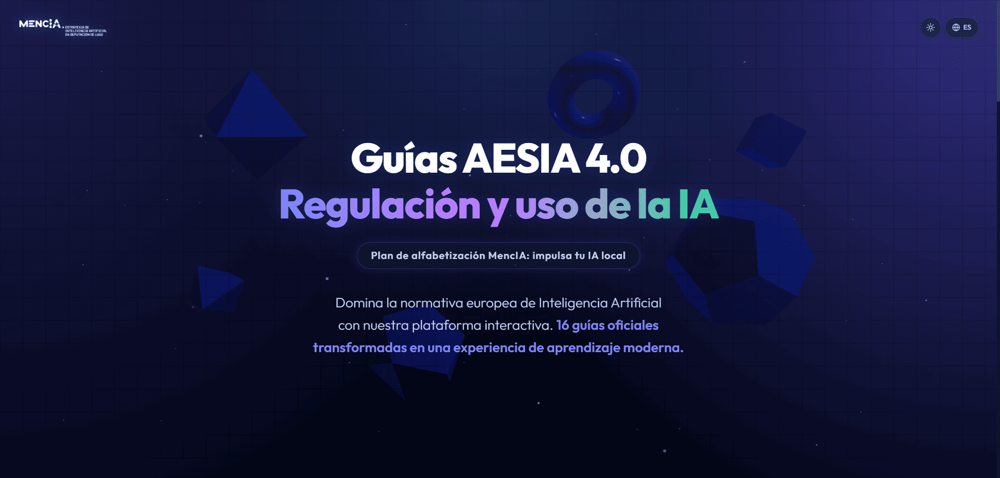

# 📚 Guías AESIA 4.0 — Plataforma de aprendizaje interactivo

<div align="center">




**Plataforma educativa interactiva para el estudio de las Guías Técnicas de la AESIA (Agencia Española de Supervisión de la Inteligencia Artificial)**

🌐 [**Acceder a la aplicación**](https://guiasaesia.vercel.app/) · [🚀 Características](#-características) · [🏗️ Arquitectura](#️-arquitectura) · [🎮 Módulos de juego interactivo](#-módulos-de-juego-interactivo) · [🌍 Soporte multiidioma](#-soporte-multiidioma) · [⚡ Instalación y puesta en marcha](#-instalación-y-puesta-en-marcha)

</div>

---

> **Nota:** Este proyecto demuestra la viabilidad de crear plataformas educativas de alta complejidad técnica y visual (Next.js 16 + React 19) utilizando exclusivamente metodologías de **Vibe Coding** (Inteligencia Artificial Generativa), acelerando radicalmente el ciclo de desarrollo desde la idea al despliegue.

---

## 🎯 ¿Qué es Guías AESIA 4.0?

**Guías AESIA 4.0** es una aplicación web moderna y visual que transforma la lectura de las **Guías Técnicas oficiales de la AESIA** (Agencia Española de Supervisión de la Inteligencia Artificial) en una experiencia de aprendizaje gamificada e interactiva.

La aplicación está diseñada para que tanto profesionales del sector tecnológico como ciudadanos interesados puedan comprender de forma rápida y entretenida los principios, requisitos y obligaciones del **Reglamento Europeo de Inteligencia Artificial (AI Act)** y las guías técnicas que lo desarrollan.

> 🏛️ Está previsto que este proyecto se integre en el plan de alfabetización en IA de [**MencIA**](https://github.com/jose-antarias/LandingMencIA), la estrategia de Inteligencia Artificial de la Diputación de Lugo, como recurso formativo interactivo para empleados públicos.

> [!NOTE]
> **Aviso de precisión:** Esta plataforma es un recurso educativo diseñado para facilitar la comprensión de la normativa. Aunque se esfuerza por ser fiel a las Guías Técnicas de la AESIA, la IA puede cometer errores de interpretación. La información oficial y vinculante se encuentra exclusivamente en los documentos originales publicados por la Agencia.

---

## ✨ Características

- 🎨 **Diseño premium UI/UX** — Interfaz adaptativa (Claro/Oscuro) con menús scroll-aware, glassmorphism y micro-animaciones fluidas
- 📖 **16 guías técnicas completas** — Cobertura total de los documentos oficiales de la AESIA
- 🃏 **Flashcards interactivas** — Sistema de tarjetas de memoria para repasar conceptos clave
- 🧠 **Quiz interactivo** — Cuestionarios de opción múltiple con retroalimentación inmediata
- 📘 **Glosario visual** — Definición de términos técnicos con navegación sencilla
- 🎮 **Juegos educativos** — Módulos de gamificación: Escape Room, Rosco RIA (Pasapalabra) e IA Aventura
- 📊 **Zona de entrenamiento** — Panel gamificado con seguimiento de progreso
- 🌍 **Multiidioma** — Español completo; Inglés, Gallego, Euskera y Catalán en desarrollo
- 📱 **Totalmente responsive** — Experiencia óptima y navegación adaptada en escritorio, tablet y móvil

---

## 🏗️ Arquitectura

```
aesia-course/
├── app/                        # Rutas de Next.js (App Router)
│   ├── page.tsx                # Página principal con HeroSection y catálogo de guías
│   ├── layout.tsx              # Layout global con providers de idioma
│   ├── globals.css             # Estilos globales y variables de diseño
│   ├── guides/
│   │   └── [id]/               # Ruta dinámica para cada guía
│   │       ├── page.tsx        # Vista principal de la guía (contenido + componentes)
│   │       ├── flashcards/     # Módulo de flashcards de la guía
│   │       ├── quiz/           # Módulo de cuestionario de la guía
│   │       └── glossary/       # Glosario de términos de la guía
│   ├── aventura/               # Juego de aventura de texto
│   ├── escape-room/            # Juego tipo Escape Room temático
│   └── pasapalabra/            # Juego tipo Pasapalabra con terminología AESIA
│
├── components/                 # Componentes React reutilizables
│   ├── HeroSection.tsx         # Cabecera principal animada
│   ├── HeroScene.tsx           # Escena 3D/visual del héroe
│   ├── GuideCard.tsx           # Tarjeta de cada guía en el catálogo
│   ├── GuideContent.tsx        # Renderizado del contenido de una guía
│   ├── GuideDetails.tsx        # Vista detallada con navegación por secciones
│   ├── FlashcardDeck.tsx       # Mazo de flashcards interactivo
│   ├── QuizModule.tsx          # Motor de cuestionario con puntuación
│   ├── GuideGlossary.tsx       # Glosario visual con búsqueda
│   ├── TrainingZone.tsx        # Panel gamificado de entrenamiento
│   ├── EscapeRoomGame.tsx      # Lógica del juego Escape Room
│   ├── PasapalabraGame.tsx     # Lógica del juego Pasapalabra
│   ├── LanguageProvider.tsx    # Contexto de internacionalización (i18n)
│   ├── LanguageSwitcher.tsx    # Selector de idioma en la navbar
│   ├── Navbar.tsx              # Barra de navegación principal
│   ├── RiskClassifier.tsx      # Visualizador interactivo de clasificación de riesgos
│   ├── RiskMatrix.tsx          # Matriz de riesgos visual
│   ├── ConformityRoadmap.tsx   # Hoja de ruta de conformidad interactiva
│   └── ...más componentes visuales temáticos
│
├── lib/                        # Lógica de negocio y datos
│   ├── data/
│   │   ├── es.ts               # Datos completos de las guías en español
│   │   ├── en.ts               # Datos en inglés (en desarrollo)
│   │   ├── gl.ts               # Datos en gallego
│   │   ├── eu.ts               # Datos en euskera
│   │   ├── ca.ts               # Datos en catalán
│   │   └── index.ts            # Exportaciones y función getGuides()
│   ├── i18n/                   # Traducciones de la interfaz de usuario
│   ├── aventuraData.ts         # Datos del juego de aventura
│   ├── escapeRoomData.ts       # Datos del juego Escape Room
│   └── pasapalabraData.ts      # Datos del juego Pasapalabra
│
└── public/                     # Recursos estáticos (imágenes, iconos)
```

---

## 📚 Guías técnicas cubiertas

La aplicación cubre las **16 guías prácticas** publicadas por la AESIA para el cumplimiento del Reglamento Europeo de IA, organizadas en los tres bloques oficiales:

### 📘 Bloque 1 — Guías introductorias

| # | Guía | Descripción |
|---|------|-------------|
| 01 | Introducción al Reglamento de IA | Comprensión general del RIA, su alcance normativo, ámbito de aplicación y principales obligaciones. Familiariza al lector con los conceptos clave de forma breve y estructurada. |
| 02 | Guía práctica y ejemplos para entender el Reglamento de Inteligencia Artificial | Comprensión del Reglamento desde un enfoque práctico, con introducción a las guías técnicas y ejemplos hipotéticos de sistemas de IA de alto riesgo. |

### ⚙️ Bloque 2 — Guías técnicas

| # | Guía | Descripción |
|---|------|-------------|
| 03 | Evaluación de conformidad | Orientación sobre el proceso de evaluación de conformidad ("marcado CE") al que deben someterse los sistemas de IA de alto riesgo. |
| 04 | Sistema de gestión de la calidad | Medidas organizativas y técnicas para que proveedores y responsables del despliegue cumplan los requisitos de gestión de la calidad. |
| 05 | Sistema de gestión de riesgos | Medidas para identificar, analizar, evaluar y mitigar los posibles riesgos de un sistema de IA. Incluye herramienta Excel con casos de uso. |
| 06 | Supervisión humana | Garantía de que las personas puedan tomar decisiones autónomas y con conocimiento de causa en relación con los sistemas de IA. |
| 07 | Datos y gobernanza del dato | Requisitos de gobernanza de datos para sistemas de IA de alto riesgo: calidad, trazabilidad, representatividad y completitud de los datos. |
| 08 | Transparencia y provisión de información a los usuarios | Medidas de implementación para proveedores y usuarias de sistemas de IA que faciliten el cumplimiento de las obligaciones de transparencia. |
| 09 | Precisión | Medidas para garantizar que los sistemas de IA no degraden sus especificaciones de rendimiento y exactitud una vez puestos en marcha. |
| 10 | Solidez | Medidas para que los sistemas de IA sean resilientes frente a comportamientos perjudiciales o indeseables. |
| 11 | Ciberseguridad | Medidas en materia de ciberseguridad específicas para sistemas de IA, integradas en un esquema de ciberseguridad más amplio. |
| 12 | Registros y archivos de registro generados automáticamente | Medidas para la generación y conservación de registros que todo sistema de IA de alto riesgo debe incorporar. |
| 13 | Plan de vigilancia poscomercialización | Actividades para recolectar y evaluar la experiencia obtenida tras el despliegue e identificar las acciones correctoras necesarias. |
| 14 | Notificación de incidentes graves | Procedimiento de notificación de incidentes graves y medidas para abordar correctamente dicho proceso. |
| 15 | Documentación técnica | Qué exige el Reglamento europeo de IA a la documentación técnica, cómo reflejarla y cómo debe ser conservada. |

### ✅ Bloque 3 — Checklists

| # | Guía | Descripción |
|---|------|-------------|
| 16 | Manual de checklist de guías de requisitos | Herramienta de diagnóstico para los 12 requisitos clave: calidad, riesgos, supervisión humana, datos, transparencia, precisión, solidez, ciberseguridad, registros, documentación técnica, vigilancia poscomercialización y gestión de incidentes. |

---

## 🎮 Módulos de juego interactivo

### 🃏 Flashcards
Sistema de tarjetas de doble cara (pregunta/respuesta) para memorizar conceptos clave de cada guía. Con animación de giro y seguimiento de respuestas correctas.

### 🧠 Quiz
Cuestionarios de **opción múltiple** con 4 alternativas por pregunta. Muestra la puntuación final, resaltando las respuestas correctas e incorrectas con explicaciones.

### 📘 Glosario
Diccionario visual de términos técnicos de regulación IA con búsqueda en tiempo real y ordenación alfabética.

### 🔐 Escape Room
Juego temático de resolución de puzzles ambientado en el mundo de la conformidad con el AI Act. El jugador debe superar retos de conocimiento para "escapar".

### 🔤 Rosco RIA (Pasapalabra)
Clásico juego de letras adaptado con terminología del Reglamento europeo de IA. Pon a prueba tu vocabulario regulatorio de forma divertida con sistema de pistas integrado.

### 🗺️ IA Aventura (Aventura de texto)
Juego de rol narrativo donde el jugador toma decisiones en escenarios hipotéticos de despliegue de sistemas de IA y debe elegir las respuestas conformes al reglamento.

---

## 🌍 Soporte multiidioma

| Idioma | Código | Estado |
|--------|--------|--------|
| 🇪🇸 Español | `es` | ✅ Completo |
| 🇬🇧 Inglés | `en` | 🔜 En desarrollo |
| 🏴󠁧󠁢󠁥󠁮󠁧󠁿 Gallego | `gl` | ⚙️ En progreso |
| 🌿 Euskera | `eu` | ⚙️ En progreso |
| 🔴 Catalán | `ca` | ⚙️ En progreso |

---

## 🤖 Desarrollo asistido por IA (Vibe Coding)

Este ecosistema ha sido desarrollado íntegramente mediante **AI-Driven Development**, orquestando modelos avanzados de lenguaje (LLMs) para la arquitectura, lógica y diseño. El flujo de trabajo ha incluido:

1.  **Arquitectura Next.js 16 (App Router):** Diseño de una estructura escalable para albergar 16 guías técnicas y múltiples módulos de juego en una aplicación de página única (SPA).
2.  **Ingeniería de datos interactiva:** Transformación de las Guías Técnicas de la AESIA en estructuras de datos JSON tipadas con TypeScript para alimentar los motores de Quiz, Flashcards y Glosario.
3.  **UI/UX Premium con Tailwind & Framer Motion:** Creación de una interfaz fluida con soporte nativo para temas claro/oscuro, micro-animaciones y diseño adaptativo.
4.  **Lógica de gamificación:** Desarrollo de los motores lógicos para el *Escape Room*, el *Rosco RIA* y la *Aventura de Texto*, incluyendo validación de respuestas y persistencia de estado.
5.  **Debugging y optimización:** Resolución iterativa de conflictos de hidratación en React 19 y optimización de componentes 3D (Three.js) mediante agentes de IA.

---

## 🛠️ Stack tecnológico

| Tecnología | Versión | Uso |
|---|---|---|
| **Next.js** | 16 | Framework React con App Router |
| **React** | 19 | Librería de interfaz de usuario |
| **TypeScript** | 5 | Tipado estático |
| **TailwindCSS** | 4 | Sistema de diseño utility-first |
| **Framer Motion** | 12 | Animaciones fluidas y transiciones |
| **Three.js / R3F** | 0.182 | Escenas 3D en el HeroScene |
| **Lucide React** | 0.563 | Iconografía moderna |
| **Radix UI** | 1.2 | Componentes accesibles sin estilo |

---

## 🗺️ Hoja de ruta

| Estado | Módulo | Detalle |
|:---:|---|---|
| ✅ | Contenido de las 16 guías en español | Carga de contenido completa |
| ✅ | Interfaz adaptativa (Claro/Oscuro) | Rediseño UX y adaptación visual completados en toda la plataforma |
| ✅ | Juego: Rosco RIA | Motor de validación de respuestas (ignora mayúsculas/tildes) y sistema de pistas operativos |
| ✅ | Juego: IA Aventura | Sistema de misiones y persistencia de datos ("El Nexo", etc.) corregido |
| 🔜 | Inglés | Pendiente de integrar la traducción oficial |
| 🔜 | Gallego, Euskera y Catalán | Traducción e integración en progreso |
| 🔧 | Zona de gamificación y retos | Pendiente de pulir dinámicas en submódulos restantes y balanceo general |

---

## ⚡ Instalación y puesta en marcha

### Prerrequisitos
- **Node.js** `>= 18.x`
- **npm** `>= 9.x`

### Pasos

```bash
# 1. Clona el repositorio
git clone https://github.com/jose-antarias/Guias-AESIA-4.0.git
cd Guias-AESIA-4.0

# 2. Instala las dependencias
npm install

# 3. Inicia el servidor de desarrollo
npm run dev
```

La aplicación estará disponible en **[http://localhost:3000](http://localhost:3000)**

---

## 📄 Uso

Este proyecto es de uso educativo y está orientado a la divulgación de las Guías Técnicas de la AESIA. El contenido regulatorio pertenece a sus respectivos autores institucionales.

---

## 🤝 Contribuciones

Las contribuciones son bienvenidas. Si deseas ampliar el contenido de alguna guía, añadir un nuevo idioma o mejorar algún módulo de juego, abre un *Issue* o envía un *Pull Request*.

---

## 📜 Licencia

Este proyecto está bajo la Licencia **MIT**. Consulta el archivo [LICENSE](./LICENSE) incluido en el repositorio para más detalles.

---

## 👨‍💻 Autor

**Jose Antonio Arias Lombardero**
*Experto en Inteligencia Artificial aplicada al sector público, innovación, contratación y fondos europeos.*

Esta aplicación forma parte de un portfolio de soluciones tecnológicas conceptualizadas, desarrolladas y desplegadas en entornos cloud para su aplicación en el sector público. Mi objetivo es demostrar cómo el uso estratégico de modelos avanzados de IA (Vibe Coding) puede escalar radicalmente la digitalización, la operatividad y la alfabetización tecnológica de la Administración.

🔗 [Consulta mi portfolio completo de aplicaciones y trayectoria profesional](https://ja-lombardero.vercel.app/)

---

<div align="center">
Construido con ❤️ para la divulgación de la regulación de IA en España
</div>
